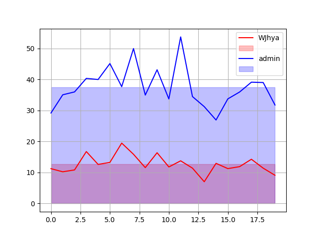
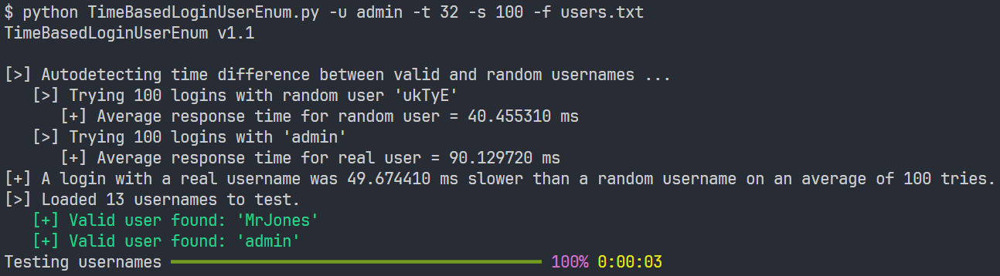

# Time based information leak

This example side channel exploits a time-based information leak vulnerability. The exploit can enumerate if a username is valid by analysing the different response times for a valid versus invalid username. The threat actor would use datasets from data breaches, with the now verified usernames, to perform a more targeted dictionary attack informed by the corresponding known previous passwords.

> [!Note]
> Students are not expected to be able to duplicate this application or understand the complex Python implementation. This example is to model how information can leak and then be exploited only.

## Requirements

```bash
pip install requests
pip install matplotlib
pip install rich
```

## Demonstration

### Step 1: Setup

The app needs to be running on port 5000 and the list of usernames to test are in [users.txt](users.txt).

### Step 2: Analysis of time differences between valid and invalid usernames

Now you need to analyse whether there is a time based leak of information on the login alogorythm. This is down by comparing the average login time of 20 attempts for a known username (admin) versus the average login time of 20 attempts for a random string username:

```python
python TimeBasedLoginAnalysis.py -u admin -S
```



### Step 3: Enumerate usernames based on response times

Now that we know that there is a time based leak of information, we can enumerate each user in a list [users.txt](users.txt) by comparing the average login time of 100 attempts for each username with the average login time of 100 attempts of a known username (admin):

```python
python TimeBasedLoginUserEnum.py -u admin -t 32 -s 100 -f users.txt
```


